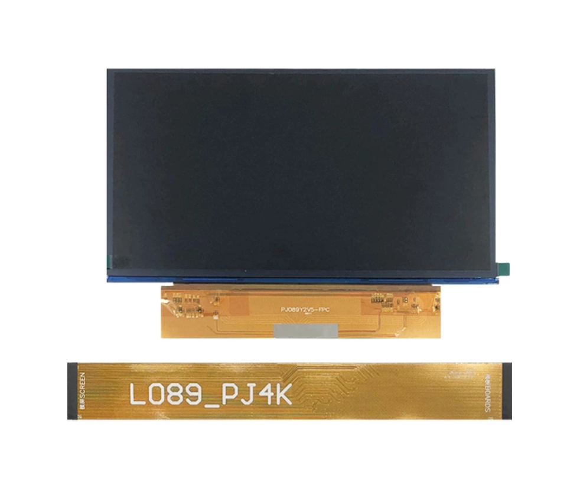
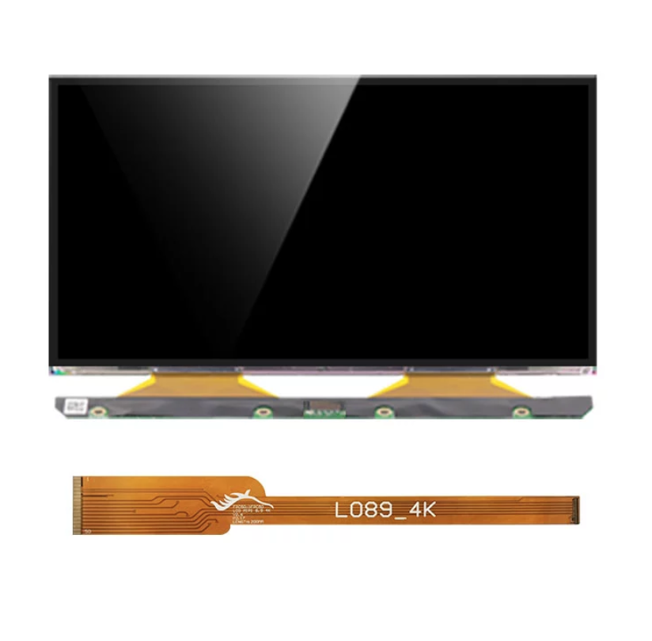

# ChiTuLM1Board
 ```
 วิธีการติดตั้ง Firmware เมนบร์อดซิตูเซิสเต็ม และ เฟิมแวร์ที่ใช้งานกับจอโมโนโครม
  2 โมเดล 
 ```
## ข้อมูลเทคนิค 
```
  ChiTu L M1 Monochrome Board With TMC2209 Driver STM32F407 32Bit 
 Support 8.9 inch 4k Mono LCD 3D Printer
 The firmware option is FPGA firmware come with board,
 you can also update yourself from our download page.
```
## ค่า Parameters:
  - Mainboard size：120*85mm
  - Microprocessors：STM32F407(168Hz)
  - Input voltage:12~24V 5~15A
  - Motor driver：TMC2209
  - TFT color touch screen：2.8/3.5/4.3/5.0 inch
  - Supported LCD screen：8.9 4K monochorme
  - Data interface:U disk, Network port
  - File format: ctb
  - Slice software：CHITUBOX
  - Flash memory chip:EMMC


## โมเดลจอ 
  - PJ 8.9inch monochrome 4K LCD
    
  - Tianma 8.9inch monochrome 4K LCD
    


